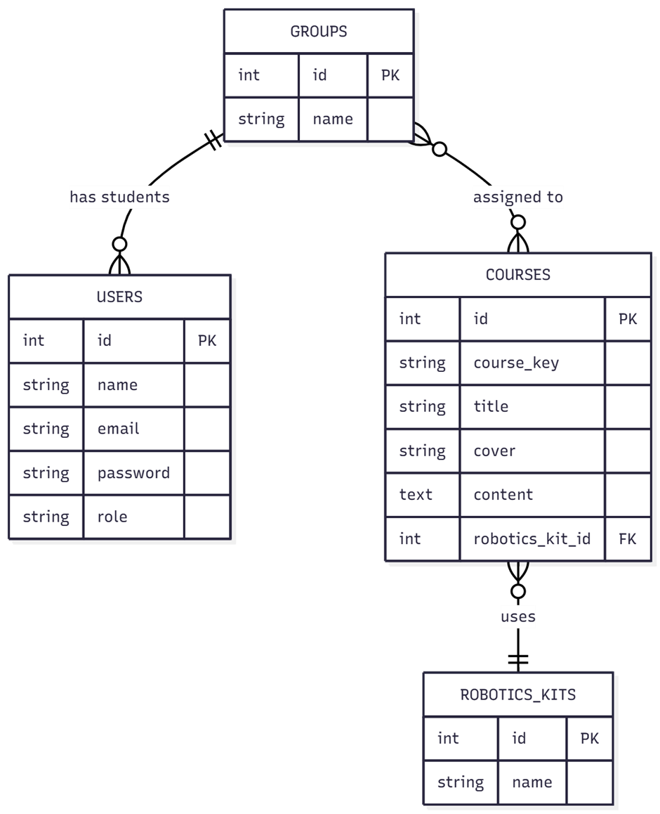

# Activity 7 – ER Diagram and Eloquent ORM Modeling

## 📌 Project Description
This project was developed as part of **Activity 7** for the Robotics School case study.  
The objective is to model a relational database using **Laravel 7** and **Eloquent ORM**, based on the following requirements:

- Users can be **students**, **teachers**, or **administrators**.
- A **student** belongs to a **group**.
- A **group** can have several **courses**.
- A **course** uses one **robotics kit**.
- Groups can be beginner, intermediate, advanced (and more in the future).

---

## 📊 Deliverables

- **ER Diagram**  
    
  *(exported as PNG, also available in `/docs/` folder)*

- **Database Export**  
  SQL file with all tables and relationships:  
  [`database/export/activity7.sql`](database/export/laravel.sql)

- **GitHub Repository**  
  This repository contains:
  - Laravel 7 project (`activity7`)
  - Models, Controllers, and Migrations
  - Relationships defined in Eloquent
  - SQL export and ER diagram

---

## 🗂️ Project Structure
activity7/ ├── app/Models/         # User, Group, Course, RoboticsKit ├── app/Http/Controllers/ ├── database/migrations/ # All migration files ├── database/export/     # activity7.sql ├── docs/                # ER diagram (PNG/PDF) ├── routes/ └── README.md


---

## 🚀 How to Run
1. Clone the repository:
   ```bash
   git clone https://github.com/<your-username>/activity7.git
   cd activity7
2. Install dependencies:
   ```bash
    composer install
    npm install
3. Configure .env with your database credentials.
4. Run migrations:
   ```bash
    php artisan migrate